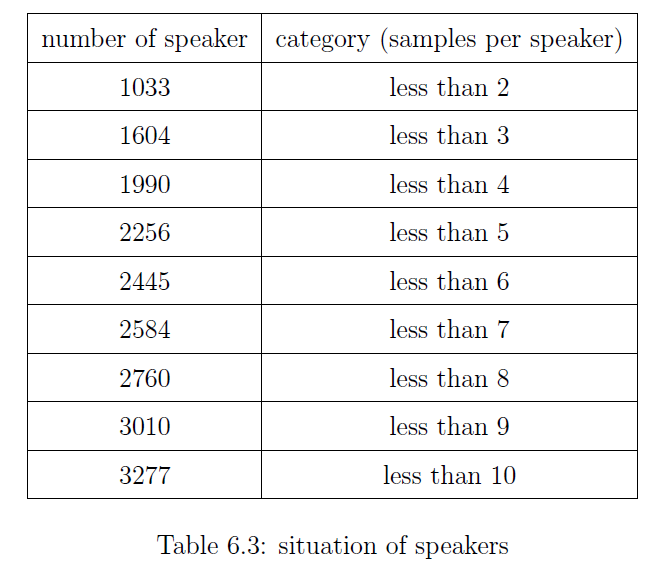
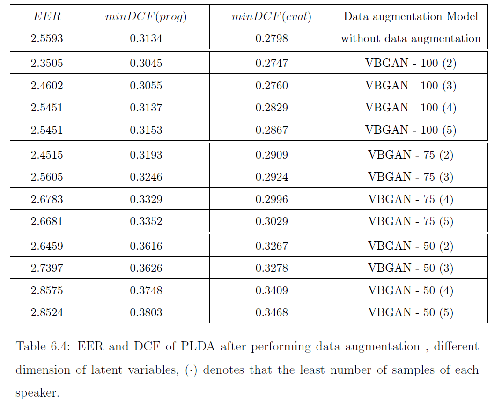

# Variational Bayesian GAN for Speaker-Recognition
There are a total of 4958 speakers in the dataset of NIST i-vector machine learning challenge. We counted the number of samples of each speaker that is less than n in the dataset where n range from 2 to 10. The table shows the result. We can find out there is one fifth of speakers with one sample. The dataset is unbalanced.

  
  

